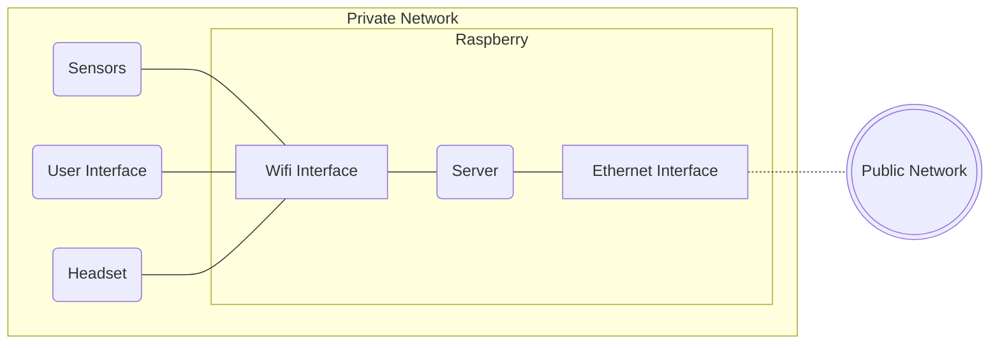

# Mixed Reality Server
## Getting started
This repository contains all the files needed to implement a mixed reality environment server with a Raspberry. <br>
The server has the following task:
- Act as an Access Point to create a private network
- Act as a DNS Server
- Act as an API Server
- Act as a Websocket Server
- Act as a proxy to serve the User Interface files

All the devices connected with the Raspberry will be able to surf the internet if the device is connected with a Ethernet Cable.


## Development conditions
The system has been developed in the following conditions:
- Python 3.11
- Raspberry Pi OS 32-bit with desktop kernel version 5.15 and Debian version 11
- Raspberry Pi 3 B+

## Hardware Requirements
You will need:
- A raspberry Pi 3 or 4
- A micro SD
- A Micro-SB card USB adapter
- A Micro-USB cable with an adaptator
- An Ethernet Cable
- A keyboard
- A mouse
- A display with the HDMI input
- An HDMI cable

## Installation
Flash into a microSD the Raspberry Pi OS with Desktop (Raspberry Pi Imager is strongly recomended for this task) and setup the device.<br>
Don't use the WiFi to connect the device to the network but use the Ethernet cable. <br><br>
When you have finished open a terminal and type the following commands:
```bash
sudo apt update
sudo apt upgrade -y
```
### Set up the Raspberry Hotspot
To create an hotspot with Raspberry Pi please follow [this tutorial](https://www.tomshardware.com/how-to/raspberry-pi-access-point).<br>
The name you will choose for the network and its password is not important even if it's highly recomended to use a strong password.<br>

### Install all the needed files
To install the server follow these steps:
1. Open a new terminal
2. Install Nginx
```bash
sudo apt-get install nginx
```
3. Install ufw
```bash
sudo apt-get install ufw
```
4. Close and re-open the terminal
5. Allow the needed port for Nginx and SSH. <br>
    These commands will open the Raspberry Pi ports 80 and 22 only for the devices that are connected to the Hotspot (this is a security choice). <br>
```bash
sudo ufw allow 'Nginx HTTP'
sudo ufw allow ssh
``` 
6. Activate the firewall
```bash
sudo ufw activate
```
6. Create a new folder for the APIs in the <code>/var/www</code> folder
```bash
mk dir /var/www/API
```
7. Clone the repository
```bash
git clone https://gitlab.epfl.ch/create-lab/sensing-with-vr/server.git /var/www/API
```
8. Modify the file <code>/var/www/API/setup.sh</code> and set the needed parameters. <br>
A more detailed guide on the parameters is provided here and here. 
9. Run the installation scripts (it will handle all the needed setup operations) <br>
```bash
sudo bash /var/www/API/install.sh
```
10. When it will have finished it will automatically reboot the system and then you are ready to go!
## Personalized domains
During the installation process a DNS server will be set up and you will be able to access all the DNS saved on it by connecting to the Raspberry Pi hotspot. <br>
Here we list all the created domains and their description:
- <code>ui.raspberry.epfl.com</code>: user interface
- <code>api.raspberry.epfl.com</code>: api gateway
- <code>websocket.raspberry.epfl.com</code>: websocket gateway

The domains has been chosen to avoid any possible problem with existing domain. </br>
It's highly recomended to avoid changing these DNS.

## Structure
The structure of this repository is the following:
```bash
├───index.py # It contains the Flask app definition
├───install.sh # Script that handles the installation
└───modules
    ├───db    
    │   ├─── connection.py # Handles the connection
    │   ├─── models.py # Handles the database management for the models
    │   └─── textures.py # Handles the database management for the textures
    ├───errors.py # Management of the errors
    ├───serverImplementation.py # Implementation of all the functions
    └───settings.py # Main settings of the application

```

## User Interface Integration
You should define the user interface repository url inside the <code>install.sh</code> at the following line of code:
```bash
USER_INTERFACE_REPOSITORY_URL=""
```
with this line of code you will define the repository url for the user interface. <br>
You can both choose to use the default user interface (its repository is [here](https://gitlab.epfl.ch/create-lab/sensing-with-vr/user-interface)) or create a new one. <br>
If you want to create a new user interface you can find the API endpoints in the docs folder.

## WebSocket Integration
You should define the websocket repository url inside the <code>install.sh</code> at the following line of code:
```bash
WEBSOCKET_REPOSITORY_URL=""
```
with this line of code you will define the repository url for the websocket interface. <br>
You can both choose to use the default user interface (its repository is [here](https://gitlab.epfl.ch/create-lab/sensing-with-vr/user-interface)) or create a new one. <br>
If you want to create a new one keep in mind that you should implement the following endpoints:
- <code>/model_created</code> [POST]: this endpoint will be called when a model has been created.
- <code>/model_updated</code> [PUT]: this endpoint will be called when a model has been uploaded.
- <code>/model_delete</code> [DELETE]: this endpoint will be called when a model has been deleted.
- <code>/texture_created</code> [POST]: this endpoint will be called when a new texture has been created.
- <code>/texture_deleted</code> [DELETE]: this endpoint will be called when a texture has been deleted.

If you use the default virtual environment or the default user interface you should also implement the following personalized events:
- <code>model_texture_selected</code>: event thrown when the texture of a model has been selected. It can be thrown both from the virtual environment or from the user interface.
- <code>model_texture_deselected</code>: event thrown when the texture of a model has been deselected. It can be thrown both from the virtual environment or from the user interface.

## Authors
This repository is part of the project *"Mixed Reality Environment For Harvesting Study"* done by Alessandro Dalbesio.<br>
The project has been done in the CREATE LAB (EPFL).<br>
Professor: Josie Hughes<br>
Supervisor: Ilic Stefan<br>

## License
This project is under [MIT] license
