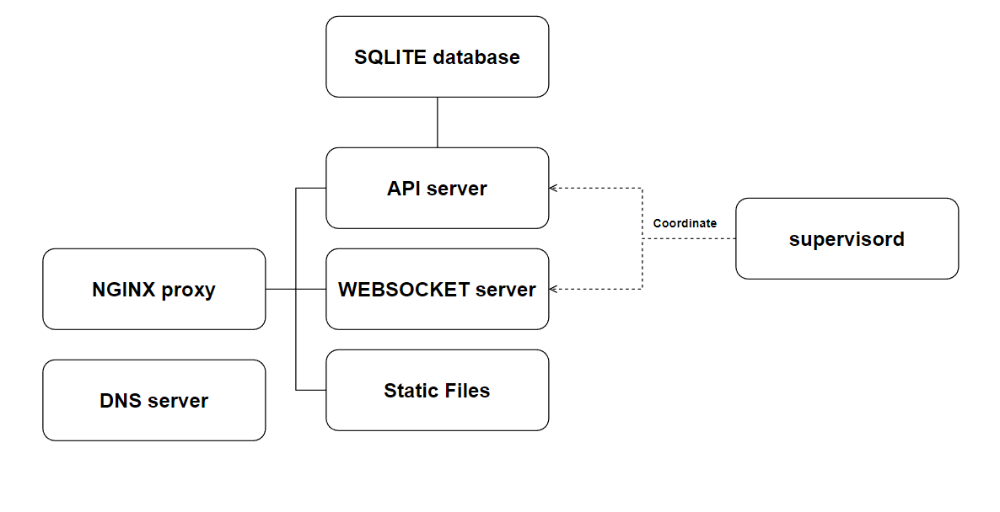

# Server
## Getting started
This repository contains all the files needed to implement a server on a Raspberry Pi which can be used to manage all the files and texture needed in a virtual environment. <br><br>
After the installation as soon as you will turn on the Raspberry it will: 
- Act as an Access Point to create a private network
- Act as a DNS Server
- Act as an API Server
- Act as a Websocket Server
- Act as a proxy to serve all the static files required

All the devices should be connected to the WiFi of the Raspberry. <br>
To have access to internet you should connect the Raspberry with an ethernet connection (the WiFi is needed!). <br><br>
A schema of the server is displayed below: <br>


## Installation
Flash into a microSD the Raspberry Pi OS with Desktop (Raspberry Pi Imager is suggested for this task) and setup the device.<br>
Don't use the WiFi to connect the device to the internet but use the Ethernet cable.
### Set up the Raspberry Hotspot
To create an hotspot with Raspberry Pi please follow [this tutorial](https://www.tomshardware.com/how-to/raspberry-pi-access-point).<br>
The name you will choose for the network and its password is not important for the installation even if it's highly recomended to use a strong password.<br>

### Installation
To install the server you should follow these steps:
1. Open a new terminal
2. Update and upgrade the system
```bash
apt-get upgrade
apt-get update -y
```
3. Create a folder
```bash
mkdir /usr/local/server
```
3. Clone the repository
```bash
git clone https://gitlab.epfl.ch/create-lab/sensing-with-vr/server.git /usr/local/server
```
4. Modify the parameters in <code>modules/settings.py</code> and <code>install.sh</code> to make the server compatible with your needs. A brief description of the parameters is provided in the files.
5. Run the installation scripts
```bash
sudo bash /usr/local/server/install.sh
```
6. Go to /var/www and modify the <code>settings</code> files of the services
7. Restart the system
8. When the system has started up check that no errors are present in the log files

## Code Structure
The code structure is:
```bash
├───index.py # It contains the Flask app definition
├───install.sh # Script that handles the installation
└───modules
    ├───db    
    │   ├─── connection.py # Handles the connection
    │   ├─── models.py # Handles the database management for the models
    │   └─── textures.py # Handles the database management for the textures
    ├───colors.py # Utilities functions for color management
    ├───logging.py # Management of the errors
    ├───serverImplementation.py # Implementation of all the functions
    └───settings.py # Main settings of the application

```

## User Interface
You should define the user interface repository url inside the <code>install.sh</code> at the following line of code:
```bash
website_repo_url=""
```
You can both choose to use the default user interface (its repository is [here](https://gitlab.epfl.ch/create-lab/sensing-with-vr/user-interface)) or create a new one. <br>
If you want to create a new user interface you should have a look at <code>index.py</code> for the endpoints available.


## WebSocket Server
You should define the websocket repository url inside the <code>install.sh</code> at the following line of code:
```bash
websocket_server_repo_url=""
```
You can both choose to use the default user interface (its repository is [here](https://gitlab.epfl.ch/create-lab/sensing-with-vr/websocket-server)) or create a new one. <br>
The Websocket Server choosen doesn't affect the API server but affect the ability of the User Interface and the Headset to communicate between each other.

## Errors management
All the errors produced by the server will be writen in files available in the folder <code>/var/www/API</code>. In this folder there will be both the file for the errors generated from the server and the file for the errors generated by <code>supervisord</code> which is a process control system used to manage the server <br>
If something goes wrong the server will generate automatically an unique ID that can be used to identify the error.

## Development conditions
The system has been developed in the following conditions:
- Python 3.11
- Raspberry Pi OS 32-bit with desktop kernel version 5.15 and Debian version 11
- Raspberry Pi 3 B+


## Authors
This repository is part of the project *"Mixed Reality Environment For Harvesting Study"* done by Alessandro Dalbesio.<br>
The project has been done in the CREATE LAB (EPFL).<br>
Professor: Josie Hughes<br>
Supervisor: Ilic Stefan<br>

## License
This project is under [MIT] license
